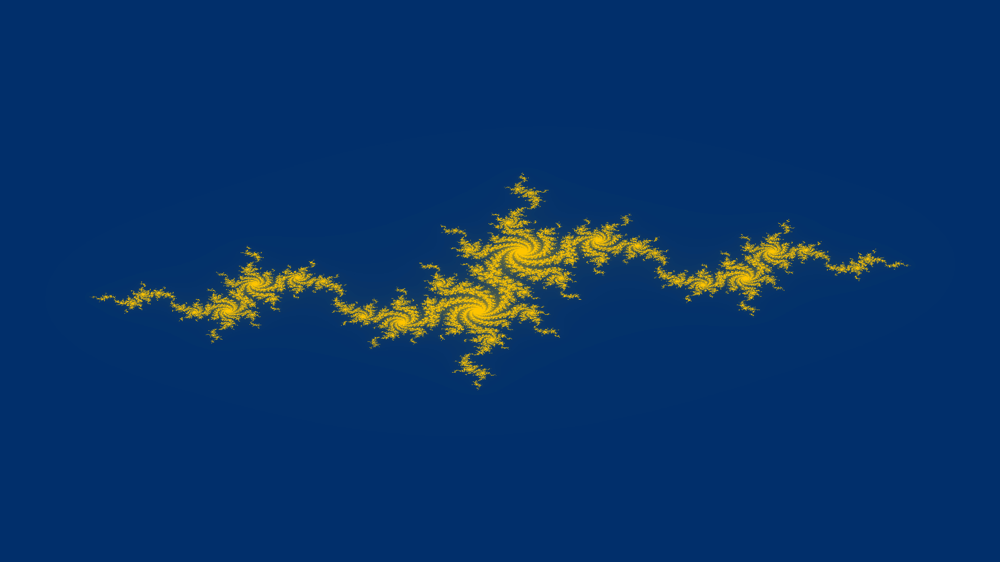

# JuliaSet

A program that generates julia set images like the one below:

## Usage

The program takes four arguments. The first and second arguments are the real and imaginary components of the complex constant `c` respectively. The third and fourth arguments are the x and y dimensions of the image respectively. The program will then generate a black and white juliaset image as a jpg file named `jimage` using these parameters in your current directory.