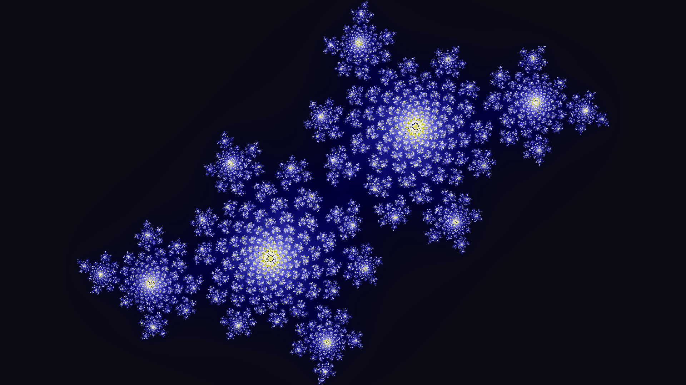

# JuliaSet

A program that generates Julia Set images.

## Usage

### Installation (Clone and build)

NOTE: Project can only be built on Unix-based platforms like Linux/macOS/Cygwin for now.

Make sure that you have make and g++ installed. Both of these can be acquired using `apt-get`. Clone the git repository into your local machine using `git clone` and entering the remote repository. You can then build and install using `make install`. This will build the project and install the binary in `/usr/bin`.

### Command line interface

The program uses CImg option parsing to retrieve command line arguments. To set options, type the name of the option, followed by the value of the option: `$ juliaset -[name] [value] ...`. If the value is a boolean, you can just type the name of the option to set it to true: `$ juliaset -[boolean-option]`. Options do not have to be put in any order.

Here are a list of options:

| Option |                           Description                          |  Defaults  |
|:------:|:--------------------------------------------------------------:|:----------:|
| -cr    | The real component of the complex constant                     | 0.0        |
| -ci    | The imaginary component of the complex constant                | 0.0        |
| -mbrot | Generates the mandelbrot set image (overrides -cr and -ci)     | false      |
| -imgx  | The width of the image                                         | 1920       |
| -imgy  | The height of the image                                        | 1080       |
| -zoom  | The zoom scale of the image                                    | 1.0        |
| -offx  | The x offset of the image                                      | 0.0        |
| -offy  | The y offset of the image                                      | 0.0        |
| -rot   | The angle of rotation of the image                             | 0.0        |
| -save  | The filename to save to                                        | jimage.jpg |
| -cmap  | The colormapping used (see gallery to look at colormaps)       | rainbow    |
| -cmaps | Lists all of the colormaps and returns (overrides all options) | false      |