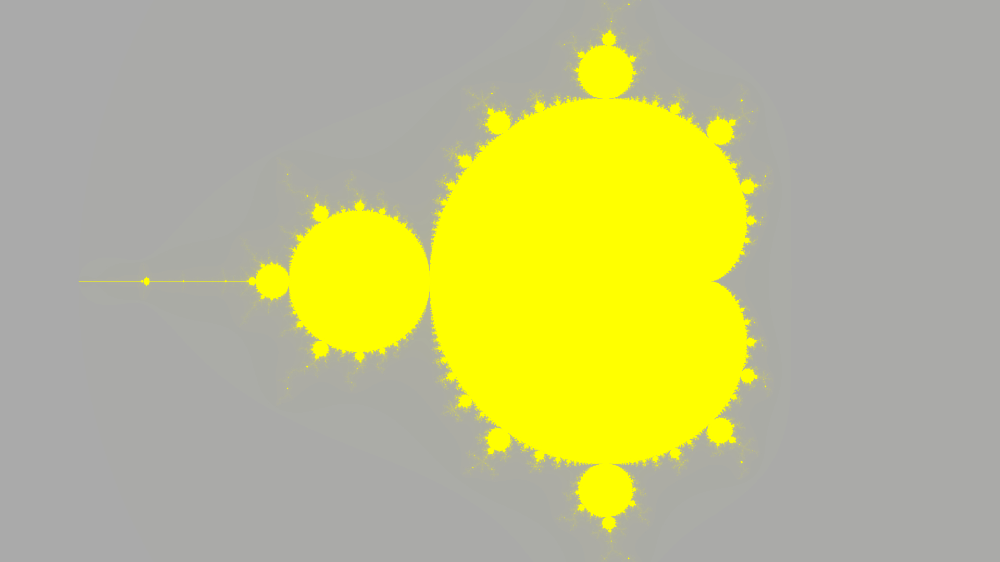

# Fractal Generator

A program that generates Julia and Mandelbrot set fractal images.


## Background

### Fractals

Shapes can have what is known as Fractal Symmetry (or Zoom Symmetry). That is, the shape will be retained when zoomed in to any level. Discovered by Benoit Mandelbrot in the late 70's, this symmetry appears all around in nature, from trees and blood vessels to clouds, mountains, even the galaxy and the universe.

There are many ways to generate fractal patterns. Loren Carpenter of Pixar for example, was one of the first to use fractal landscape generation to create the virtual mountainsides in many animation movies (like paradise falls in Up). This fractal generation algorithm computes the Julia set (or Mandelbrot set) of a function and maps the results as a color map on the image, creating fractal patterns that represent the interesting behaviour of complex numbers.

### Complex Numbers

The square root of -1 is defined as `i`. This number doesn't exist naturally, but it is used often for it's unique properties. When multiplied by a real constant, say `b`, the result is an imaginary number `bi`, the square of which will be negative the square of the constant, or `-b^2`, since `i^2 = -1`.

A complex number can be defined as the sum of a real number with an imaginary number `a + bi`. The sum of two complex numbers is simply the sums of the real components plus the sums of the imaginary components

	(a + bi) + (c + di) = (a + b) + (c + d)i

The product of two complex numbers is more interesting. The components must be distributed with each other, but since `i^2 = -1`, the product of the two imaginary components is a _negative_ real number, rather than positive. So the real of the product is the difference of the two real product terms.

	(a + bi)(c + di) = (ac - bd) + (ad + bc)i

Consider two complex numbers represented as shown:

	A = r*(cos(a) + sin(a)i)
	B = s*(cos(b) + sin(b)i)

The product of these two numbers reveals a consequence of imaginary multiplication:

	A*B = r*(cos(a) + sin(a)i) * s*(cos(b) + sin(b)i)
		= r*s*((cos(a)cos(b) - sin(a)sin(b)) + (cos(a)sin(b) + sin(a)cos(b))i)

		= r*s*(cos(a + b) + sin(a + b)i)

Complex numbers can be represented as vectors on an xy grid, where the x component of the vector represents the real component, and the y component of the vector represents the imaginary component. The product of two complex numbers, then, can be represented by the vector whose magnitude is the product of the magnitudes of the two complex vectors and whose angle is the sum of the angles of the two complex vectors. Naturally, then, the square of a complex number will be a complex vector with a magnitude equal to the square of the original magnitude, and an angle equal to twice the original angle.

	A   = r*(cos(a) + sin(a)i)
	A^2 = r^2*(cos(2a) + sin(2a)i)

### The Julia Set

Consider the complex function `f(z) = z^2 + c`, where `c` is a constant. Take a complex number `z` and put it through the function, then take the result and put it back into the function, doing this repeatedly infinatum. This iterative process can be written as `z[a+1] = z[a]^2 + c`. Because of the nature of complex numbers, after infinite iterations, the modulus of these numbers will either reach infinity, converge to zero, or remain bounded in an endless loop, depending on the value of `z[1]`.

The Julia Set is the map of all complex numbers that either reach infinity or remain bounded.

For example, consider a constant of `0` for now, so the iterative function becomes `z[a+1] = z[a]^2`. Start at `z[1] = 2 + 3i`. The first few iterations result in `z[2] = -5 + 12i`, followed by `z[3] = -119 - 120i`, then `z[4] = -239 + 28560i`. This set seems to go to infinity under infinite iteration. Now consider `z[1] = 0.5 + 0.75i`. The next few iterations of this number would be `z[2] = -0.31 + 0.75i`, `z[3] = -0.47 - 0.47i`, and finally `z[4] = -0.0036 + 0.43i`. This set will eventually converge to zero. The Julia Set, loosly speaking, is the map of all complex numbers that either reach infinity or remain bounded under infinite iteration. Because `c = 0`, the Julia set is a simple circle with a radius of `1`, since any number that is less than 1 decreases in value when squared, and any number greater than 1 increases in value when squared. Adding a non-zero constant `c` will complicate the set.

Julia Sets can be approximated by using a computer. Each image is a complex grid ranging from -2 to 2, and from -2i to 2i (the width bounds are extended according to the image aspect ratio). Each pixel represents an approximate complex number in the grid. The computer goes through these pixels, and performs at most 256 iterations of the function `z[a+1] = z[a]^2 + c` on the complex number, and maps the number of iterations it took for the set to reach infinity (at all) to a color (according to a set color map), creating the complex patterns.


### The Mandelbrot Set

Running the algorithm with multiple different numbers, one may determine that some values will yield juliaset with many infinite values and a monochromatic image, some will yield large blob-like patterns, and some will create intricate crystal-like structures. The Mandelbrot set developed by Benoit Mandelbrot, is a sort of roadmap of these various sets. This is generated with the same function, but, instead of assigning each pixel value to the initial value of the set, we set it to the value of the constant c and set the initial value of the set to z to 0. Running this process on each pixel will generate an image like this.



The yellow regions on the Mandelbrot Set are the c constants that will generate blob shapes, while the grey areas are those that will create barely visible dust-like shapes. The sweet-spot is around the edge of the mandelbrot set, as these complex values will generate complex crystal shapes.

## Usage

### Installation (clone and build)

NOTE: Project can only be built on bash-based platforms (so macOS, Linux, or cygwin).

Make sure that you have `make` and `g++` installed. Both of these can be acquired using `apt-get`. Clone the git repository into your local machine using `git clone` and entering the remote repository. You can then build and install using `make install`. This will build the project and install the binary in `/usr/bin`.

### Command line Interface

The program uses CImg option parsing to retrieve command line arguments. To set options, type the name of the option, followed by the value of the option: `$ juliaset -[name] [value] ...`. If the value is a boolean, you can just type the name of the option to set it to true: `$ juliaset -[boolean-option]`. Options do not have to be put in any order.

Here are a list of options:

|    Option     |                                 Description                                 |  Defaults  |
|:-------------:|:---------------------------------------------------------------------------:|:----------:|
|     -cr       | The real component of the complex constant                                  | 0.0        |
|     -ci       | The imaginary component of the complex constant                             | 0.0        |
|     -mbrot    | Generates the mandelbrot set image (overrides -cr and -ci)                  | false      |
|     -imgx     | The width of the image                                                      | 1920       |
|     -imgy     | The height of the image                                                     | 1080       |
|     -zoom     | The zoom scale of the image                                                 | 1.0        |
|     -offx     | The x offset of the image                                                   | 0.0        |
|     -offy     | The y offset of the image                                                   | 0.0        |
|     -rot      | The angle of rotation of the image                                          | 0.0        |
|     -save     | The filename to save to                                                     | jimage.jpg |
|     -cmap     | The colormapping used                                                       | rainbow    |
|     -cmaps    | Lists all of the colormaps and returns                                      | false      |
|     -test     | Generates a 400x300 test image (saved to the savename) for the set colormap | false      |
| -help (or -h) | Prints the help message                                                     | false      |

#### Using an XML File

You can also run the fractal generator with an xml file containing all of the information of the fractals being generated to the program, rather than put the info in manually. Just type `fractal -xml [your xml file]` in the command line.

Each fractal image being generated is represented by a `fractal` tag. Fractal files can have multiple `fractal` tags.

```xml
<fractal save="fractal.jpg">
	<complex real="-0.4" imag="-0.6"/>
	<size width="1920" height="1080"/>
	<transform angle-"30" zoom="2">
		<offset real="-0.4" imag="-0.3"/>
	</transform>
	<colormap type="gradient">
		<start>0x00AA00</start>
		<end>0xFF00FF</end>
	</colormap>
</fractal>
```

Fractal objects must have a `save` attribute defined, which determines the location that the file is to be saved to. They can also have an `mbrot` attribute, a boolean that is true if the image being generated is the mandelbrot set, but defaults to false.

The complex tag is optional and defaults to 0 + 0i (it is also ignored if the mbrot attribute is set to true). The real component of the complex is set by the real attribute, while the imaginary component is set by the imag attribute. For example, `<complex real="-0.4" imag="-0.6"/>` equals a complex number of -0.4 - 0.6i. These do not have to be both defined, i.e. `<complex real="-0.4"/>` is also valid and equals -0.4 + 0i.

The size tag is required and must define a height and width component, which correspond to the height and width of the image to be generated. `<size width="400" height="300">` sets the image width to 400 and the image height to 300.

The transform component defines the transformation of the image (the zoom, offset, and angle). The angle represented by the attribute `angle` (defaults to 0), and the zoom is represented by the attribute `zoom` (defaults to 1). The offset is represented by a child tag in the transform named offset. It is identical to the complex tag, in that it has `real` and `imag` attributes which define the real and imaginary components of the offset complex.

##### Colormaps

The colormap tag defines the colormap to use when generating the image. This can be defined in one of three ways.

##### Gradient

The gradient type linearly interpolates between two given color values. The gradient requires that a `start` and `end` tag be defined, which color values as integers. These are the start and end color values respectfully.

```xml
<colormap type="gradient">
	<start>0x00AA00</start>
	<end>0xFF00FF</end>
</colormap>
```

##### Rainbow

The rainbow type computes three sinusoidal functions for the red green and blue values of the color, each with it's own phase and frequency. The rainbow type requires `phase` and `freq` components, both of which require `r`, `g`, and `b` attributes which define the red, green, and blue values of both paramters respectfully. These values have defaults, for `phase`, these are all 0, and for `freq`, these are all 1.

```xml
<colormap type="rainbow">
	<phase r="0.2" g="1.5", b="5.4"/>
	<freq r="2" g="1" b="4"/>
</colormap>
```

##### Preset

Finally, you can set a preset colormap instead using the `preset` attribute. The value of the attribute is the name of the preset, and this attribute supercedes all other options, i.e. if the preset is set, the colormap will be set to the preset, and not be defined by any other parameters set. 

```xml
<colormap preset="noir"/>
```